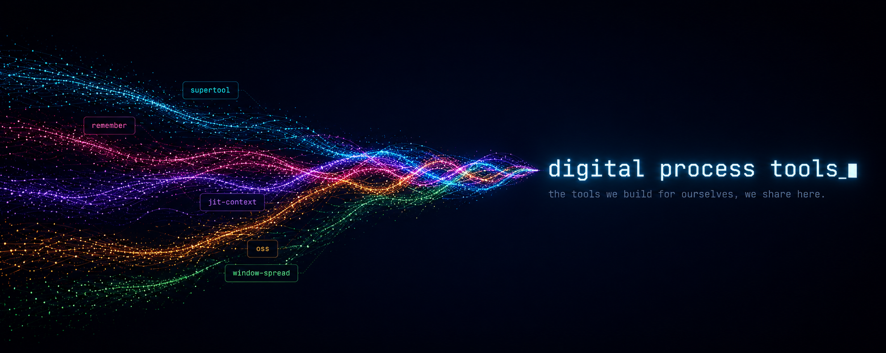

# .github

Organization-level files for [Digital Process Tools](https://github.com/Digital-Process-Tools).

GitHub reads a few things from a repository named `.github` and applies them across the whole
organization. That is the only reason this repository exists — nothing here is a product.

| Path | What GitHub does with it |
| --- | --- |
| `profile/README.md` | Rendered as the organization profile page at [github.com/Digital-Process-Tools](https://github.com/Digital-Process-Tools). |
| `profile/banner.png` | The banner image that page links to. |

## The plugin list is generated in part

The **Latest from max.dp.tools** section of `profile/README.md` sits between
`<!-- BLOG:START -->` and `<!-- BLOG:END -->` and is replaced by automation. Edit around those
markers, not inside them.

Everything above the markers — the plugin and MCP server cards — is written by hand. Adding a new
plugin means adding a card there, with its banner served from that plugin's own repository over
`raw.githubusercontent.com`, so the image travels with the project rather than being copied here.
